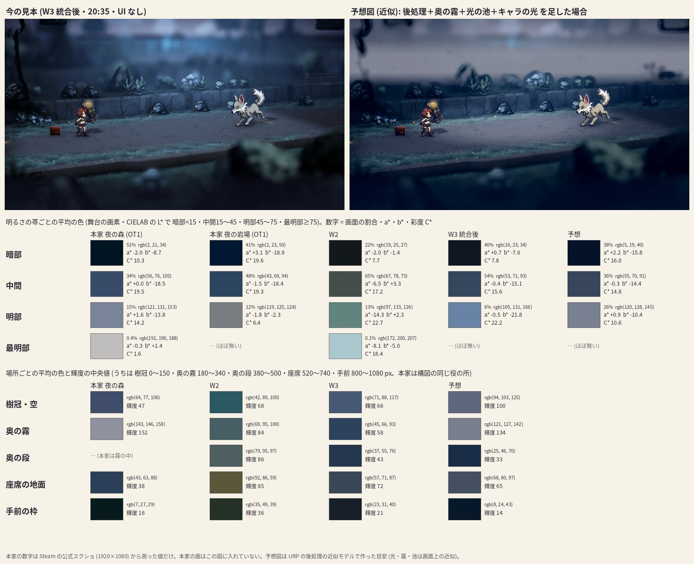

# 本家の色彩 (HD-2D 見本の色の設計書)

2026-09-30。ユーザー「本家っぽく」「本家の色彩も参考にしてほしい」。本家 = オクトパストラベラー1 (と2)。
この文書は2つの部分でできている。

- **§0〜§6 (手で書いた設計書・20:55)**: 本家の夜の戦闘の色を明るさの帯・場所・霧と発光・キャラに分けて測り、今の見本 (W2 と W3 の統合後) との差と、`look_act1.json`・`look_act1.char.json` のどの値をどう動かすかを書いた。機械で読む値は `honke-color.json` の `design` キー。図は `honke-color-sheet.jpg`。
- **付録 A (W3 の統合・20:36)**: `scripts/hd2d-color.py` が Oklab で出した数字と目安 (元の本文のまま)。

`scripts/hd2d-color.py --md` / `--write-design` でこの2つのファイルを書き直すと §0〜§6 と `design` キーが消える。数字だけ更新する時は別名に出すこと。

本家の画 (Steam の公式スクショ・1920×1080) は著作物なのでリポジトリに入れない。ここと図には測った数字と色の値だけを置く (図の画は見本のもの)。

## 0. 結論

1. **本家の夜は舞台の色を青ひと色にまとめる。** 舞台の色 (彩度の重み) の 88〜97% が HSV の色相 195〜235° の帯に入る。W2 は 24% (土の橙・草の黄緑・霧の青緑に散っていた)。**W3 の統合後は 97% で届いた。**
2. **暗い所は黒でなく紺。** 暗部 (L*<15) が舞台の 41〜51%。平均の色は (2,21,34)〜(2,23,50) で、赤がほぼ 0。W3 の暗部は (16,23,34) で赤が残り、灰色がかった紺 (彩度 C* 7.8。本家 10〜20)。
3. **明るくなるほど色が抜けて白に近づく。** 本家は L* 60〜75 の彩度 C* が 5、いちばん明るい所は (191,190,188)〜(202,201,196) のほぼ無彩の白 (ほんの少し暖かい)。W3 は逆で、明るい所ほど青い (L* 60〜75 で C* 21・明部の平均 (105,131,166))。
4. **画面でいちばん明るいのは奥の霧。** 主人公たちの後ろの地平の帯が輝度 152 の淡い青灰 (143,146,158)。樹冠はその 0.6 倍、座席の地面はもっと暗く、手前の枠がいちばん暗い (暗い青緑)。W3 は奥の霧の帯が 58 で座席 (72) より暗い = 奥行きの明暗が逆。
5. **キャラは舞台の色に溶かさない。** ハンイットは夜の森でも昼の色をほぼ保つ (暖色の彩度 0.79 倍・白の b* は昼 +10 → 夜 +7 の暖かい白のまま・明るさは昼の 0.82 倍)。W3 の狼の白は b* −2 (元の絵は +13) で冷えすぎ。

残っている手は、**奥の霧を明るく無彩に**・**後処理の色の膜 (colorFilter) をやめて、暗部だけ紺・明部を無彩に**・**座席の池の明暗を広く**・**キャラの光を少し暖かく**・周辺減光とブルームを本家の形に、の6つ (§4)。予想図 (図の右上) では、この6つで下の表の数字が本家の幅に入る。

| 数字 | 本家 (夜の森 / 夜の岩場) | W2 | W3 (統合後) | 予想図 |
|---|---|---|---|---|
| 青の帯の割合 | 0.88 / 0.97 | 0.24 | 0.97 | 0.97 |
| 暗部の平均の色 | (2,21,34) / (2,23,50) | (19,25,27) | (16,23,34) | (5,19,40) |
| 暗部の b* ・彩度 C* | −8.7・10.3 / −18.9・19.6 | −1.4・7.7 | −7.6・7.8 | −15.8・16.0 |
| 明部の彩度 C* | 14.2 / 6.4 | 22.7 | 22.2 | 10.6 |
| 奥の霧の帯の輝度 | 152 | 84 | 58 | 134 |
| 座席の地面 p10 / p90 | 7.5 / 101 | 41 / 103 | 25 / 87 | 18 / 119 |
| キャラの白の b* | +6.9 / +8.6 | −1.9 (狼) | −2.0 (狼) | +8.1 |

## 1. 測ったもの

| 画 | 中身 | 使い道 |
|---|---|---|
| ot_921570_16 | OT1 夜の森の戦闘 (ハンイット) | **幕1 の主な目安** |
| ot_921570_7 | OT1 夜の岩場の戦闘 (トレサ) | 夜の2枚目 (幅を取る) |
| ot_921570_2・3・6・14 | OT1 夜の戦闘 (技の火花・光の輪・氷) | 発光とブルーム |
| ot_1971650_4 | OT2 夜の平原の戦闘 (雷の技) | 青緑の発光 |
| ot_921570_11 | OT1 昼の村の戦闘 (ハンイット) | 対照 (キャラの昼の色) |
| ot_921570_1・4・10, ot_1971650_0 | 探索の夜 (町・村・雪の大聖堂・里) | 灯の色 |
| W2 | 見本 18:13 の撮影 (5場面・PC・UI なし) | 今の見本 (統合前) |
| W3 | 見本 20:35 の撮影 (5場面・PC・UI なし) | 今の見本 (統合後。`envGrade`・光を青へ) |

- 舞台 = UI とキャラを除いた画素。本家は矩形で除く (`hd2d-measure.py` の REF_PATCHES と、技の画は技の光の矩形も)。見本は `hideui` の画から `unitsonly` のマスク (2px 太らせた物) を除く。
- 色は **CIELAB** (L* = 明るさ 0〜100・a* = 緑 − ／ 赤 +・b* = 青 − ／ 黄 +・C* = 彩度) と **HSV の色相** (度。青 240・青緑 180・藍 210 前後)。輝度は `hd2d-measure.py` と同じ (Rec.709 の係数を sRGB の値 0〜255 に掛けた物)。
- 明るさの帯は L* で **暗部 <15・中間 15〜45・明部 45〜75・最明部 ≥75**。
- 見本の数字は wolf の場面の物。ogre・trio・quad・dolls も差は ±1 以内 (`honke-color.json` の `design.sample`)。
- 本家は JPEG、見本は PNG。細かい色の粒 (ノイズ) の差はあるが、平均と分布の数字には効かない。
- 付録 A の `hd2d-color.py` は Oklab・別の帯の切り方で測っている。結論は同じ。

## 2. 本家の夜の森の色の設計 (①)

### 2-1 明るさの帯ごとの色 (舞台)

| 帯 | 夜の森: 割合・平均の色 | a* ・ b* ・ C* | HSV 色相・彩度 | 夜の岩場: 割合・平均の色 | a* ・ b* ・ C* |
|---|---|---|---|---|---|
| 暗部 (L*<15) | 51%・(2,21,34) | −2.0 ・ −8.7 ・ 10.3 | 204°・0.93 | 41%・(2,23,50) | +3.1 ・ −18.9 ・ 19.6 |
| 中間 (15〜45) | 34%・(56,76,105) | 0.0 ・ −18.5 ・ 19.5 | 216°・0.46 | 48%・(43,69,94) | −1.5 ・ −18.4 ・ 19.3 |
| 明部 (45〜75) | 15%・(121,131,153) | +1.6 ・ −13.8 ・ 14.2 | 222°・0.21 | 12%・(119,125,128) | −1.8 ・ −2.3 ・ 6.4 |
| 最明部 (≥75) | 0.4%・(191,190,188) | −0.3 ・ +1.4 ・ 1.6 | 無彩 | 0.04%・(202,201,196) | −0.2 ・ +2.7 ・ 8.8 |

- **影の色 = 紺 (藍〜紺)。** HSV 204〜213° の深い青で、赤がほぼ 0。群青・紫 (240° より先) でも、青緑 (180°) でもない。CIELAB の色相では 257〜279°。
- **中間 = 鉄紺〜青鈍** (HSV 209〜216°・彩度 0.46〜0.54)。舞台の色の大部分はここ。色温度に直すと 2万K を越える強い青。
- **明部 = 淡い青灰**、**最明部 = ほぼ無彩の白** (b* +1〜+3 のわずかに暖かい白・色温度 5,800〜6,500K)。影から光へ向かって「濃い紺 → 青 → 白」と色が抜ける。

### 2-2 明るさ別の彩度

| L* | 0〜10 | 10〜20 | 20〜30 | 30〜45 | 45〜60 | 60〜75 | 75〜 |
|---|---|---|---|---|---|---|---|
| 本家 夜の森 | 8.6 | 16.2 | 17.3 | **21.7** | 16.5 | 5.2 | 1.6 |
| 本家 夜の岩場 | 18.1 | **22.1** | 20.9 | 15.8 | 6.4 | 5.5 | 8.8 |
| W2 | 6.2 | 12.1 | 16.5 | 18.5 | 21.8 | **28.2** | 18.4 |
| W3 (統合後) | 6.7 | 11.7 | 15.8 | 16.4 | **22.5** | 20.6 | 20.1 |

本家は暗い〜中間 (L* 10〜45) がいちばん色が濃く、明るくなるほど色が抜ける。見本は逆で、明るいほど色が濃い (霧と月光が青いまま明るい)。

### 2-3 明るさの形 (舞台の輝度 0〜255)

| | p1 | p5 | p25 | p50 | p75 | p95 | p99 | p99.9 | 暗部の割合 | p95÷p25 |
|---|---|---|---|---|---|---|---|---|---|---|
| 本家 夜の森 | 1.5 | 4.4 | 15.5 | 34.1 | 88.6 | 131.7 | 171.7 | 192.9 | 51% | 8.5 |
| 本家 夜の岩場 | 5.0 | 9.3 | 22.9 | 42.7 | 72.1 | 125.1 | 139.5 | 155.6 | 41% | 5.5 |
| W2 | 8.0 | 14.5 | 40.7 | 69.5 | 91.5 | 123.7 | 151.5 | 175.0 | 22% | 3.0 |
| W3 (統合後) | 2.1 | 10.1 | 24.7 | 47.2 | 74.2 | 108.0 | 144.7 | 172.5 | 41% | 4.4 |

- **黒は深く沈む** (p1 が 1.5〜5) が、沈んだ所も色は紺 (§2-1)。
- **白は飛ばさない。** 技の光を除くと輝度 250 を越える画素は 0%。いちばん明るい所 (p99.9) で 156〜193。URP の ACES の肩 (場面の 1.0 → 表示 208) と同じ形。
- **彩度の上限**: 舞台の C* の上位 1% が 30〜34 (W2 48・W3 27.5)。
- **色の数**: 16 段に量子化して 0.01% 以上ある色が 109〜125、画面の 90% を占める色が 47〜48 (W2 287・123 → W3 97・31。W3 は本家より少ないくらい)。

### 2-4 場所ごとの色と明るさ (夜の森)

| 所 | 平均の色 | 輝度 (中央値) | 読み |
|---|---|---|---|
| 樹冠・空 | (64,77,106) | 47 (敵の右の列では 88〜95) | 鈍い青。光の筋が通る |
| 奥の霧 (地平の帯) | (121,128,147)、山は (143,146,158) | 123、山は **152** | **画面でいちばん明るい**。彩度の低い淡い青灰 (C* 7〜13) |
| 座席の地面 | (43,63,88) | 38 (p10 7.5・p90 101) | 暗いが、光の当たる所と影の差が大きい |
| 手前の枠 | (7,27,29)、列では (12,35,37) | 16.5 | いちばん暗い。ここだけ色相が**暗い青緑** (HSV 185°) = 影に沈んだ草 |

敵の右の列を縦に見ると: 樹冠 88〜95 → 地平の霧 109〜**152** → 地面 88〜102 → 手前 21〜34。**奥ほど明るい (空気遠近)**。手前の暗い枠と明るい奥の霧のあいだに座席が挟まる。

### 2-5 霧・光の筋・発光

- **霧**: 奥の霧は (121,128,147)〜(143,146,158)。霧の中でいちばん明るい上位 5% は (188,187,186) = ほぼ無彩の白。**霧は青いが鮮やかではない** (C* 7〜13)。
- **光の筋 (月光)**: (147,152,170) の淡い藤青。周りの中央値の **3.25 倍** (夜の岩場 2.4 倍)。
- **蛍**: 芯は (218,205,188) の暖かい白 (彩度 0.03〜0.14)・芯 2〜7px・にじみは 3〜11px で消える。
- **灯・たいまつ**: 芯はほぼ白 (彩度 0.04〜0.16)・**にじみが橙** (色相 10〜30°・彩度 0.3〜0.7)。にじみが芯の明るさの 10% に落ちる半径 (r10) が 25〜45px (1080p)。
- **技の光**: 芯は 253〜255 で飛ぶ・色はにじみにだけ乗る (火 5〜30°・氷 190〜200°・光 45〜50°)。r10 が 29〜55px。
- **本家2 の雷 (青緑の発光)**: 芯は (205,249,248) の青緑がかった白・にじみは青 (色相 205〜226°・彩度 0.4〜0.9)。青の舞台に青緑のアクセントを置く時の手本。
- **ブルームの作法 = 芯は白、色はにじみ、にじみは広く薄い** (3% まで落ちる半径が 35〜55px)。
- **周辺減光**: 画面の角 ÷ 中央の明るさが 0.075 (夜の森)・0.19 (夜の岩場)。構図 (手前の暗い木) と周辺減光の両方で、縁を強く沈める。

### 2-6 キャラ (詳しくは §5)

| | 暖色 (肌・髪・革) | 白 (明るい布) | 体の輝度の中央値 |
|---|---|---|---|
| ハンイット 昼の村 | (211,176,159) C* 19.1 | (234,219,203) b* +10.3 | 191 |
| ハンイット 夜の森 | (177,146,136) C* 15.1 (昼の 0.79 倍) | (209,195,185) b* +6.9 | 157 (昼の 0.82 倍) |
| トレサ 夜の岩場 | (188,163,144) C* 15.8 | (216,210,195) b* +8.6 | 190 |

夜でも**キャラは暖かい色のまま**。舞台の青はキャラに乗らない。主人公の体は足元の地面の 1.5〜2.2 倍明るい。

## 3. 今の見本との差 (②)

| 数字 | 本家 (夜の森 / 夜の岩場) | W2 | W3 (統合後) | 判定 |
|---|---|---|---|---|
| 青の帯 (HSV 195〜235°) の割合 | 0.88 / 0.97 | 0.24 | 0.97 | ○ |
| 暗部の平均の色 | (2,21,34) / (2,23,50) | (19,25,27) | (16,23,34) | △ 赤が残り灰色寄り |
| 暗部の b* ・ C* | −8.7・10.3 / −18.9・19.6 | −1.4・7.7 | −7.6・7.8 | △ 色が薄い |
| 中間の色 | (56,76,105) / (43,69,94) | (67,78,73) 緑がかった灰 | (53,71,93) | ○ 彩度がやや低い (C* 15.6 対 19.4) |
| 明部の色・C* | (121,131,153) 14.2 / (119,125,128) 6.4 | (97,133,126) 22.7 | (105,131,166) 22.2 | × 青すぎ |
| L* 60〜75 の彩度 | 5.2 / 5.5 | 28.2 | 20.6 | × 明るいほど青い |
| 舞台の C* の上位 1% | 30.5 / 34.4 | 48.4 | 27.5 | ○ |
| 暗部の割合 | 51% / 41% | 22% | 41% | ○ |
| 輝度 p25 ・ p50 | 15.5・34.1 / 22.9・42.7 | 40.7・69.5 | 24.7・47.2 | ○ わずかに明るい |
| 輝度 p95 | 131.7 / 125.1 | 123.7 | 108.0 | △ 明るい所が足りない |
| 奥の霧の帯 | 152 (143,146,158) | 84 (69,95,100) 青緑 | 58 (45,66,93) | × 奥が暗い |
| 樹冠・空 | 47〜95 (64,77,106) | 68 (42,89,100) 青緑 | 66 (71,88,117) | ○ |
| 座席の地面 | 38 (p10 7.5・p90 101) | 85 (92,86,59) 土色 | 72 (57,71,87)・p10 25・p90 87 | △ 明暗の幅が狭い |
| 手前の枠 | 16.5 (7,27,29) 暗い青緑 | 36 (35,49,39) | 21 (23,31,40) 紺灰 | ○ 色は紺寄り |
| 光の筋 ÷ 周り | 3.25 / 2.4 (147,152,170) | 1.9 (81,154,163) 青緑 | 2.4 (135,158,192) | △ |
| 角 ÷ 中央 | 0.075 / 0.19 | 0.46 | 0.33 | △ |
| 画面の 90% を占める色の数 | 48 / 47 | 123 | 31 | ○ |
| キャラの白の b* | +6.9 / +8.6 | 狼 −1.9 | 狼 −2.0・鬼 +4.9 | × 冷えすぎ |
| 主人公 ÷ 足元の地面 | 2.2 / 1.5 | このは 0.35 | このは 0.64・狼 2.1 | △ このはの絵が暗い (P23 の持ち上げの話) |

W2 から W3 で色相・暗部の割合・色の数は本家に届いた。残る差は **明るい側** (霧・明部・光の筋・池) と **キャラの白** に集まっている。

## 4. 見本で合わせる手段と値の目安 (③)

予想図 (図の右上) は、W3 の画を URP の後処理の近似モデル (ACES と Color Grading の式を numpy で写した物) で「後処理の前の明るさ」に戻し、下の 4-1〜4-4 と §5 を足してから後処理を掛け直した物。**光・霧・池は画面の上の近似** (霧 = 画面の縦の帯 × ピントの外の所・池 = 座席の中の楕円) なので、形は Unity で撮って確かめる。値はすべて `look_act1.json` の sRGB の値 (0〜1)。

### 4-1 奥の霧を明るく、淡く (いちばん効く)

| キー | 今 | 目安 | 理由 |
|---|---|---|---|
| `fog.height.color` | [0.284, 0.401, 0.551] | **[0.56, 0.57, 0.60]** (後処理を変えない時は [0.60, 0.58, 0.59]) | 霧が満ちた所の表示を本家の奥の霧 (143,146,158) に。今の色は満ちると (29,83,143) の鮮やかな空色 (C* 38。本家の霧は C* 7〜11) |
| `fog.height` の位置 (`top`・`depthStart`・`depthFull`) | top 4.0・20〜32 | いちばん明るい帯を**奥の段のすぐ上** (PC で画面の縦 180〜340px) に | 奥の段の上の岩・草は霧の手前の影絵にする。樹冠は霧の山の 0.5〜0.7 倍 |
| `fog.lobe.color` | [0.469, 0.585, 0.716] | **[0.60, 0.61, 0.66]** | 芯は白に近い淡い青 (本家の霧の上位 5% (188,187,186))。今の色は満ちると (101,147,189) |
| `fog.lobe.strength` | 1.1 | 1.0 | |
| `fog.color` (距離の霧) | [0.116, 0.184, 0.27] | **[0.36, 0.38, 0.44]** | 遠くの木が溶ける色を本家の樹冠 (64,77,106) に。今の色は満ちると (3,20,45) で奥が沈む |

目安の数字: 奥の霧の帯の輝度 135〜160 (今 58)・樹冠 ÷ 霧の山 0.5〜0.7。予想図では帯が 134、明部の割合 6% → 26% (本家 12〜15%)。
色の値は「霧が満ちた画素が、提案の後処理 (4-2) でその色に見える値」を近似モデルの逆算で出した物。`StageModule` の霧が色をどう混ぜるか (高さの霧の濃さ・芯の足し算) で実際の値は動くので、撮って帯の輝度と色で詰める。

### 4-2 後処理: 色の膜をやめ、暗部だけ紺・明部を無彩に

| キー | 今 | 目安 | 理由 |
|---|---|---|---|
| `post.colorFilter` | [0.95, 0.98, 1.04] | **[1.0, 1.0, 1.0]** | 画面全体を冷やすので、キャラの白まで冷える。舞台の青は今は光と `envGrade` が作っている |
| `post.liftGammaGain.lift` | [1, 1, 1, 0] | **[0.94, 0.99, 1.10, −0.01]** | 暗部を紺に。予想図で暗部 (16,23,34) → (5,19,40)・b* −7.6 → −15.8・C* 7.8 → 16 |
| `post.liftGammaGain.gamma` | [1, 1, 1, 0] | **[0.98, 0.99, 1.04, 0]** | 中間を少し青へ (本家 b* −18.5) |
| `post.liftGammaGain.gain` | [1, 1, 1, 0] | **[1.04, 1.0, 0.94, 0]** | 明るい所を無彩〜わずかに暖かく (本家の最明部 b* +1〜+3)。キャラの白も暖かいまま |
| `post.contrast` | 10 | **14** | 暗部の割合と p25 を本家へ (予想図で p25 25 → 19) |
| `post.saturation` | 0 | 0 | 彩度はキャラにも掛かるので動かさない。舞台の彩度は 4-5 |
| `post.exposure` | 0.3 | 0.3 | キャラの `exposureRef`・`blackLiftExposureRef` が 0.3 を基準にしている。舞台の明るさは光で決める |
| `post.tonemap` | aces | aces | 本家の白の上限 (舞台の p99.9 が 156〜193・250 越え 0%) は ACES の肩と同じ形。Neutral にしない |

後処理だけ (4-1・4-3・§5 なし) でも、暗部は b* −16.9・C* 17.2 で本家の幅に入り、キャラの白は b* −0.5 → +4.1 まで戻る。

**使わない物**:
- **Color Curves の Lum vs Sat** (明るい所の彩度を落とす): 舞台の明部は抜けるが、キャラの白も抜ける (予想図で b* +8.1 → +3.7)。明部の青は霧と光の色 (4-1・4-4) で抜く。
- **White Balance・Channel Mixer**: 色相は光と `envGrade` で本家の帯に入った (青の割合 0.97)。今は要らない (今の `StageLook.cs` はこの2つを読まない)。
- **LUT**: 最後に全部を1枚の LUT に焼くのは、値が決まってから。

### 4-3 座席の地面の明暗を広く (光の池)

- 目安: 座席の地面の輝度 **p10 ≦ 20・p90 ≧ 100** (今 25 / 87・本家 7.5 / 101)。
- 手段: 池の中を明るく・外を暗く。`lamp.pool.level` 0.8 → 1.0〜1.2、`lamp.mask.outside` 0.1 → 0.06 を始めの値に。予想図は池の中 ×1.5・外 ×0.8 で p10 18・p90 119。
- `lamp.color` [0.795, 0.868, 0.963]・`moon.color`・`ambient` の色相 (HSV 213〜214°) は本家の帯。変えない。

### 4-4 光の筋と灯

| キー | 今 | 目安 | 理由 |
|---|---|---|---|
| `materials.glow.tint` | [0.706, 0.743, 0.836] | [0.57, 0.59, 0.645] | 月光の筋を本家の (147,152,170) に (色の向きはほぼ今のまま) |
| `materials.glow.intensity` | 1.2 | 1.6 | 筋を周りの中央値の 3 倍に (本家 3.25・今 2.4) |
| `backlight.color` | [0.4, 0.8, 0.95] | そのまま | 脈の青緑はアクセントとして残す (本家2 の雷と同じ = 芯は青緑の白・にじみは青)。当たる範囲は奥の芯の周りだけに |

蛍・灯・結晶は**芯を白く飛ばし、色はにじみに**。発光の強さを HDR で 2 以上にすると、ブルーム (4-7) でにじみに色が乗る。

### 4-5 舞台の彩度 (`envGrade`)

| キー | 今 | 目安 | 理由 |
|---|---|---|---|
| `envGrade.desaturate` | 0.72 | 0.62〜0.66 | 舞台の中間の C* 15.6 → 17〜20・舞台の C* 上位 1% 27.5 → 28〜34 (本家 19.5・30〜34) |
| `envGrade.tint` | [0.74, 0.9, 1.08] | そのまま | 中間の色相 HSV 213° が本家 (209〜216°) に入っている |

地面のタイルの彩度 (`act1_layout.json` の `sat`) は `envGrade` が上から掛かるので据え置き。本家は手前の枠の草だけ暗い青緑 (HSV 185°) を残す。見本の手前の枠は紺灰 (208°) なので、手前の草・茂みだけ青を弱めると本家に近い (任意)。

### 4-6 周辺減光

| キー | 今 | 目安 | 理由 |
|---|---|---|---|
| `post.vignette.intensity` | 0.25 | **0.35** | 角の明るさの倍率 0.57 → 0.24 (URP の式)。本家の角 ÷ 中央 0.08〜0.19・今 0.33 |
| `post.vignette.smoothness` | 0.45 | 0.5 | |
| `post.vignette.color` | [0.02, 0.02, 0.06] | [0.01, 0.03, 0.07] | 本家の縁は黒でなく暗い紺〜青緑 (手前の枠 (7,27,29)) |

### 4-7 ブルーム

| キー | 今 | 目安 | 理由 |
|---|---|---|---|
| `post.bloom.threshold` | 1.0 | 1.0 | 舞台そのものは光らせない |
| `post.bloom.intensity` | 0.8 | 1.0 | 灯・結晶のにじみ r10 を 25〜45px に (今の見本の小さな光は 4〜7px) |
| `post.bloom.scatter` | 0.65 | 0.75 | にじみを広く薄く |
| `post.bloom.tint` | [0.92, 0.98, 1.0] | [1.0, 1.0, 1.0] | 色は光源の色で決める (本家は芯が白・色はにじみ) |

## 5. キャラの色の扱い (④)

**舞台に溶かしすぎない。** 本家は舞台を青に沈めても、キャラの暖色と白は昼の色に近いまま残す。

| | 暖色の C* | 白の b* | 体の輝度 |
|---|---|---|---|
| 本家 ハンイット 昼 → 夜 | 19.1 → 15.1 (0.79 倍) | +10.3 → +6.9 | 191 → 157 |
| 見本 狼 元の絵 → W3 | 18.1 → 12.4 | **+12.9 → −2.0** | 161 |
| 見本 オーガ 元の絵 → W3 | 23.7 → 29.6 | +20.6 → +4.9 | 79 |
| 見本 このは 元の絵 → W3 | 35.3 → 28.2 (0.80 倍) | (白は少ない) | 45 (足元の地面 70) |

- 見本のキャラは暖色の彩度は保てている (0.8 倍) が、**白が冷えている** (狼 b* −2)。原因は3つ: 後処理の `colorFilter` (画面全体を冷やす)・キャラのキーの色 [0.92, 0.96, 1.0]・環境光の上下 (青寄り)。
- **舞台の色の手 (光・霧・`envGrade`) はキャラの板に掛からない** ので、そちらで舞台を青くし、キャラの光は中立〜わずかに暖かくする。後処理はキャラにも掛かるので「暗部だけ紺・明部を無彩」に留め、中間の色相は動かさない (4-2)。

`look_act1.char.json` の目安 (4-2 と合わせて、予想図でキャラの白 b* −0.5 → +8.1・暖色の C* 27.8 → 29.2・キャラの輝度の中央値 96 → 108):

| キー | 今 | 目安 |
|---|---|---|
| `char.key` | [0.92, 0.96, 1.0] | [0.96, 0.96, 0.94] |
| `char.ambTop` | [0.62, 0.66, 0.80] | [0.63, 0.66, 0.75] |
| `char.ambBottom` | [0.38, 0.40, 0.50] | [0.39, 0.40, 0.47] |
| `char.ambientScale` | 1.0 | 1.1 (舞台を暗くしても、キャラの明るさは保って少し上げる) |

キャラの目安の数字: **白の b* +5〜+9**・**暖色の彩度は元の絵の 0.8 倍以上**・**主人公の体 ÷ 足元の地面 1.5 以上** (本家 1.5〜2.2・このはは今 0.64 = 絵そのものが暗い。`heroLift` の話)。

## 6. 測り直し方

- 目安の数字 (min・max と本家・W2・W3 の値) は `honke-color.json` の `design.targets`、`look` の値の目安は `design.look` と `design.charLook`。撮り直したら、PC の wolf の `hideui` と `unitsonly` の画で同じ数字を出して当てる。
- 測った道具 (作業場の Python。リポジトリには入れていない): 明るさの帯と場所の数字・発光の半径・キャラの色の切り出し・URP の後処理の近似モデル (ACES の RRT と ODT の近似・Color Adjustments・Lift/Gamma/Gain・Shadows Midtones Highlights・White Balance の式) と逆算。Oklab での比べは `scripts/hd2d-color.py` が同じ役をする (付録 A)。
- 予想図の限界: 後処理の式は近似 (半精度と LUT の量子化は無視)。霧は「画面の縦の帯 × ピントの外の所」、池は「座席の中の楕円」、キャラの光は「キャラの画素の色を掛ける」で近似した。数字の向きと大きさの目安で、最終の値は Unity で撮って決める。

---

## 付録 A. `scripts/hd2d-color.py` の数字 (W3 の統合・20:36 の本文のまま)

2026-09-30 W3 の統合で作った (ユーザー「本家の色彩も参考にしてほしい」)。道具 `scripts/hd2d-color.py`。
本家の画 (オクトラ1 の Steam の公式スクショ・`~/.cache/deck-rogue/hd2d-ref/`) は著作物なのでリポジトリに入れない。ここには測った数字と色の値だけを置く。
色は Oklab (L = 明るさ 0〜1・a = 緑↔赤・b = 青↔黄・C = 彩度・h = 色相の角度)。舞台 = UI とキャラを除いた画素。

### 幕1 (坑口の森・夜) の目安 = 本家の夜の森の戦闘 (ot_921570_16)

- **舞台は青紫の夜**: 平均の色 #213446 (L 0.32・色味 C 0.041・h 248°)。彩度の中央値 C 0.042・上位10% 0.073・色の豊かさ 29.8。
- **明るさ別の色味** (割合・平均の色): 暗部 64% #041926 (h 237°) ／ 中間 33% #526482 (h 261°) ／ 明部 3% #a7a8ae (h 276°)。
- **縦3帯**: 上 #253956 (L 0.34) ／ 中 #3f4f66 (L 0.42) ／ 下 #0b1f28 (L 0.23)。
- **色相の割合** (彩度 0.03 以上の画素 72% の中で): 赤橙 0%・黄 0%・緑 0%・青緑 14%・青 86%・紫 0%。
- **キャラは舞台より鮮やか**: キャラの彩度 ÷ 舞台の彩度 = 1.47 倍・明るさ 1.37 倍 (矩形なので背景を含む。下限の目安)。
- **色表** (Oklab の k-means 8色・暗い順・割合): #00050a 11%・#010f18 17%・#031d2a 18%・#0f2d40 14%・#2e445e 10%・#4b5f83 15%・#6d7a94 11%・#a1a4ac 4%。

### 本家3枚の数字

| 画 | 舞台の平均の色 | 彩度の中央値 | 暗部 | 中間 | 明部 | 上の1/3 | 緑 | 青緑 | 青 | 紫 | 赤橙 | キャラ÷舞台 (彩度) |
|---|---|---|---|---|---|---|---|---|---|---|---|---|
| ot_921570_16 オクトラ1 夜の森の戦闘 (ハンイット) | #213446 | 0.042 | #041926 64% | #526482 33% | #a7a8ae 3% | #253956 | 0% | 14% | 86% | 0% | 0% | 1.47 |
| ot_921570_7 オクトラ1 洞窟の戦闘 (トレサ) | #1e364e | 0.054 | #06213c 65% | #4b6171 34% | #9e9e99 0% | #07274a | 1% | 3% | 97% | 0% | 0% | 0.94 |
| ot_921570_11 オクトラ1 昼の村の戦闘 (光の筋) | #50534d | 0.025 | #24221a 44% | #606662 39% | #aeb2b6 17% | #5e686e | 37% | 0% | 16% | 0% | 22% | 0.70 |

### 寄せる目安 (本家の夜の森との差)

門 (`gates.json`) ではない。W3 以降の色の詰め (P22 の舞台・P23 のキャラ) の物差し。`scripts/hd2d-color.py <撮影のフォルダ>` が数字と ○× を出す。

| 数字 | 目安 | 理由 |
|---|---|---|
| dEab_stage | ≦ 3 | 舞台の平均の色味 (a, b) の差。本家の夜の森と洞窟の差がこの程度 |
| chroma_ratio | 0.7〜1.3 | 舞台の彩度の中央値が本家の 0.7〜1.3 倍 |
| dEab_dark | ≦ 3 | 暗部の色味 (本家は紺〜群青) |
| dEab_mid | ≦ 3.5 | 中間の色味 (本家は青灰〜藤) |
| dEab_bright | ≦ 5 | 明部の色味 (本家は霧と月光の淡い青白) |
| hue_dist | ≦ 0.35 | 色相の割合の差 (0 = 同じ・1 = 全部違う) |
| palette_dist | ≦ 6 | 色表どうしの距離 (ΔE) |
| dE_vtop | ≦ 8 | 上の1/3 (空と樹冠と奥の霧) の平均の色 |

### 読み (色の作法)

- 本家の夜は**舞台の色を1つの色相 (青〜青紫) にまとめ、彩度を落とす**。緑の草も茶の土も、夜の光で青灰に沈む (緑・赤橙の割合が小さい)。
- **暗部は黒でなく紺** (暗部の平均の色味が青へ寄る)。明部は霧と月光の淡い青白で、暖色は小さな灯り (蛍・火の粉) だけ。
- **キャラは舞台の色の外にいる**: 舞台の彩度が低いぶん、キャラの暖色と肌の色が浮く (キャラ÷舞台の彩度が 1 より大きい)。
  → 舞台を寄せる時は舞台 (地面・崖・霧・環境光) の色を落とし、キャラは落とさない。後処理の彩度はキャラにも掛かるので控えめに。
- 上の1/3は「暗い空」ではなく**光る霧**の青白 (上の1/3の明るさ ④ の門と同じ向き)。

## 寄せた結果 (2026-09-30 W3 の統合・PC-S-wolf・目安8つの合格数)

| 撮影 | 舞台の平均の色 | 彩度 (本家比) | 色相 (緑・青緑・青) | 目安 |
|---|---|---|---|---|
| 本家 夜の森 (ot_921570_16) | #213446 | 0.042 (1.00) | 0%・14%・86% | — |
| 今 (W0。Gamma の旧舞台) | #0d2239 | 0.064 (1.52) | 7%・14%・71% | 5/8 |
| Linear 版の今 (旧舞台) | #0d193f | 0.078 (1.85) | 0%・2%・94% | 2/8 |
| W2 の見本 | #384742 | 0.042 (0.99) | 37%・18%・25% | 2/8 |
| W3 のレーンの見本 (色を寄せる前 = `look=look_act1_precolor`) | #344d47 | 0.050 (1.19) | 19%・59%・1% | 3/8 |
| **W3 の統合の見本 (既定)** | **#263345** | **0.035 (0.83)** | **0%・3%・96%** | **8/8** (スマホ相当 7/8) |

寄せ方 (`look_act1.json`): 舞台の絵だけの彩度落とし 0.72 と青への倍率 [0.74, 0.90, 1.08] (`envGrade`・StageModule の全体値 `_HD2DEnvGrade`。キャラの板には掛からない)／
光の色 (月・舞台の灯・環境光・霧・高さの霧) を Oklab の色相 約255°・彩度 0.7 倍へ／霧の芯を淡い青 (強さ 1.7→1.1)／光の面 (霧の面・月光の筋) を淡い青白 (本家の明部 #a7a8ae に近い) で強さ 1.2。
あわせて明るさも本家へ寄った: ① 舞台の中央値 87.6 → 58.6 (本家 38.4)・② 暗部 28% → 51% (本家 61%)・④ 上の1/3 97.1 → 60.5 (本家 54.7)。
残り: 明部の色味 (スマホ相当で ΔE 5.7)・キャラ÷舞台の彩度 0.6〜0.9 (本家 ≧1.47。このはと狼の絵そのものの彩度が低い。キャラの詰め P23)。

## 寄せた結果 (2026-10-01 W3b の統合・§0〜§6 の目安 `design.targets` を同じ物差しで測った・PC-S-wolf の hideui)

物差しは `scripts/hd2d-honke-targets.py` (§6 の作業場の道具の定義を写した。CIELAB・HSV の色相・Rec.709 の輝度。Oklab の `hd2d-color.py` とは別)。
`python3 scripts/hd2d-honke-targets.py "W3b:PC-S-=<slice のフォルダ>" "W3b-PH:PH-S-=<slice のフォルダ>" --scenes wolf`

| 目安 | 本家 | 門 | W3 の統合 | W3b のレーン (統合の前) | **W3b の統合** | W3b スマホ相当 |
|---|---|---|---|---|---|---|
| 青の帯の割合 (HSV 195〜235°) | 0.88 / 0.97 | ≥0.85 | 0.97 ✓ | 0.80 ✗ | 0.82 ✗ | 0.82 ✗ |
| 暗部の b*・C*・赤 | −8.7〜−18.9・10〜20・2 | ≤−8・≥10・≤8 | −7.6・7.8・17 ✗ | −23.1・24.6・3 ✓ | −22.3・23.7・4 ✓ | −20.6・21.7・6 ✓ |
| 中間の b*・C* | −18.5・19.5 | −20〜−14・17〜21 | −15.1・15.6 | −16.8・17.5 ✓ | −16.8・17.6 ✓ | −15.5・16.6 |
| 明部の C*・L* 60〜75 の C* | 14.2 / 6.4・5.2 | ≤15・≤8 | 22.2・20.6 ✗ | 11.9・18.3 | 9.0・7.7 ✓ | 9.0・7.4 ✓ |
| 暗部の割合 (L*<15) | 50.8 / 40.7 | 38〜52 | 40.5 ✓ | 57.0 ✗ | 46.1 ✓ | 51.9 ✓ |
| 輝度 p25・p50・p95・p99.9 | 15.5・34.1・131.7・192.9 | 15〜24・32〜48・120〜135・150〜210 | 24.7・47.2・108・173 | 14.3・26.1・111・142 | 16.5・42.2・**157**・181 | 16.9・30.8・157・181 |
| 奥の霧の帯 (縦 180〜340) | 152 | 135〜160 | 58 ✗ | 84 ✗ | **137 ✓** | 115 ✗ |
| 樹冠÷霧 | 0.6 | 0.5〜0.7 | 1.15 | 0.32 | 0.45 ✗ | 0.84 |
| 座席の地面 p10・p90 | 7.5・100.6 | ≤20・≥100 | 26・88 | 5.5・60 | 7.0・**73** | 6.4・75 |
| 手前の中央値 | 16.5 | 12〜25 | 21.7 ✓ | 15.7 ✓ | 16.7 ✓ | 18.1 ✓ |
| 光の筋÷周り | 3.25 / 2.42 | ≥3.0 | 2.39 | 3.15 ✓ | 2.16 ✗ | 1.58 ✗ |
| 角÷中央 | 0.075 / 0.188 | ≤0.25 | 0.333 | 0.175 ✓ | 0.171 ✓ | 0.263 |
| 狼の白の b* | 6.9 / 8.6 | 5〜9 | −2.0 | 6.9 ✓ | 6.8 ✓ | 6.7 ✓ |
| **合格** | | | **6/21** | **11/21** | **16/21** | **12/21** |

- 寄せ方 (W3b の統合で足した分・`look_act1.json`・`look_act1.dof.json`・`look_act1.char.json`・`act1_layout.json`): 月 0.4→0.45・舞台の灯 0.8→1.0・高さの霧 色 [0.56,0.57,0.60]→[0.66,0.67,0.70]・濃さ 1.2→1.8・霧の芯 0.6→1.0・舞台の上の減光 0.45→0.3・光の面 1.6→3.0 (霧の面の gain を 0.53 倍 = 筋だけ約1.9倍)・URP の周辺減光 0.25→0.15・手前のぼかし (上限 12→20px)・輪郭の目標 23→27。
- §4-2 の lift を青緑寄りにする案 ([0.94,1.00,1.07]・[0.95,1.01,1.04]) は、暗部の色相は本家へ寄る (青の帯 0.80→0.84〜0.86) が中間の青が抜けて (b* −16.8→−9.8〜−13.3・C* 17.5→12〜14.5) 灰色の霧の画になったので採らなかった。
- 残り: 青の帯 0.82 (暗部の 3 割が群青 235° より先 = lift の青と舞台だけの周辺減光の重なり)・p95 157 (霧の帯の上が明るすぎ)・座席の地面 p90 73 (本家の光の池の明暗が無い)・光の筋 2.2 (霧が明るくなって筋の比が下がった)・樹冠÷霧 0.45。Oklab の `hd2d-color.py` では 6/8 (暗部 ΔE 3.6・上の1/3 ΔE 10.7 が外れ。W3 の統合は 8/8)。
